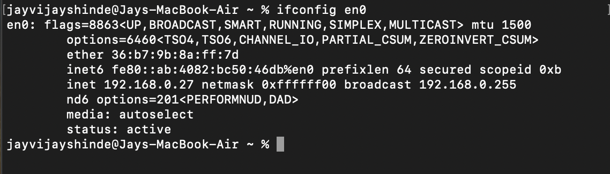
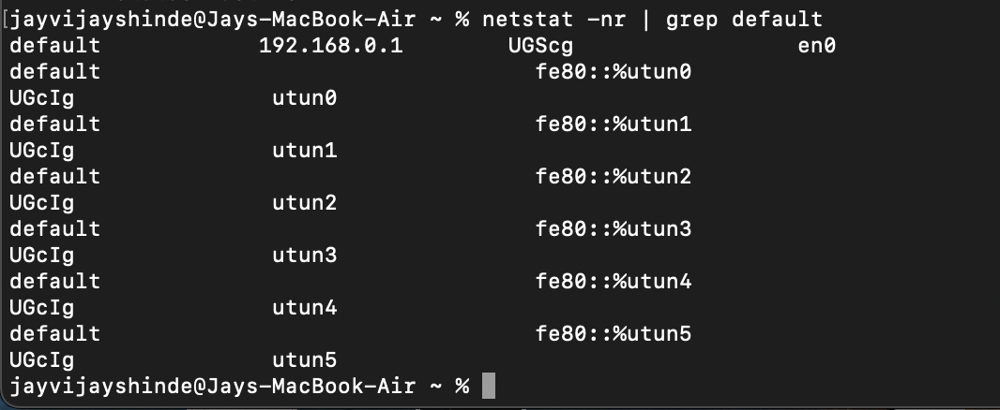
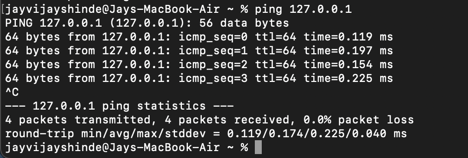
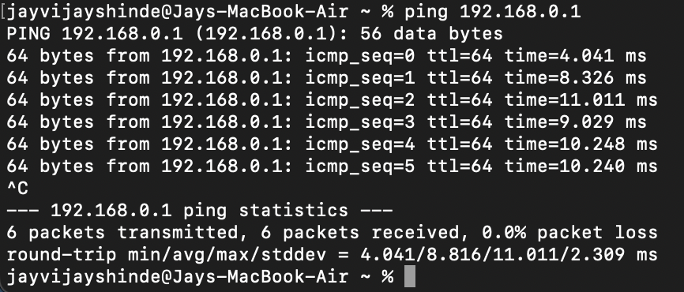
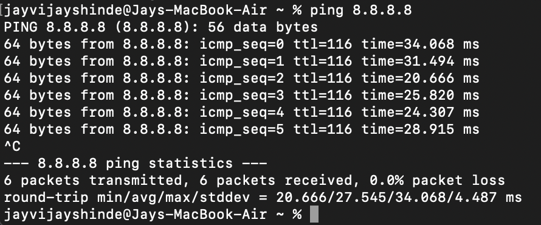
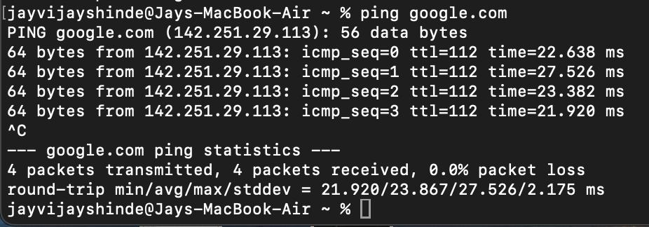
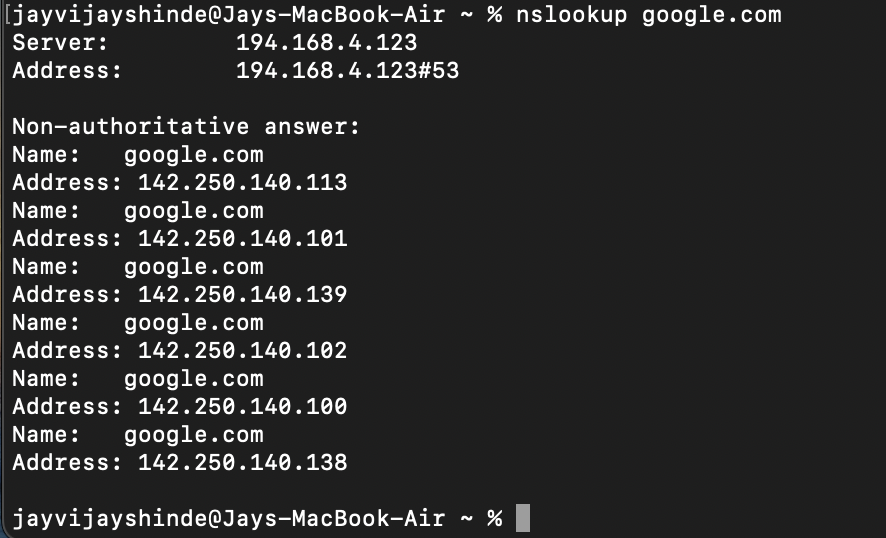

# Network Lab 1 - macOS Connectivity & DNS

## Objective
To understand basic network configuration and test connectivity using macOS terminal.

## Tools Used
- macOS Terminal

## Network Configuration
- IP Address: 192.168.0.27
- Subnet Mask: 255.255.255.0
- Network Range: 192.168.0.0/24

### Explanation

- The IP address **192.168.0.27** is a private IPv4 address assigned by the local router using DHCP.
- The subnet mask **255.255.255.0** indicates that the first 3 octets (192.168.0) represent the network, and the last octet identifies the host.
- This means the network range is from **192.168.0.1 to 192.168.0.254**.
- Since the interface status is active, the system is successfully connected to the network.

---

## Steps Performed

### 1. Checked IP Configuration
Command used: ifconfig en0
This command displays the network interface details. The `inet` field shows the assigned IPv4 address.

---

### 2. Identified Default Gateway
Command used: netstat -nr | grep default
The default gateway (e.g., 192.168.0.1) represents the router, which connects the local network to the internet.

---

### 3. Tested Local Connectivity
Command used: ping 127.0.0.1
- This tests the local loopback interface.
- Successful response confirms that the network stack on the device is working correctly.

---

### 4. Tested Router Connectivity
Command used: ping 192.168.0.1
- This tests the local loopback interface.
- Successful response confirms that the network stack on the device is working correctly.

### 5. Tested Internet Connectivity
Command used: ping 8.8.8.8
- This tests internet access without using DNS.
- Since 8.8.8.8 is a public Google DNS server, a successful ping confirms internet connectivity.

### 6. Tested DNS Resolution
Commands used: ping google.com
               nslookup google.com
- `ping google.com` checks if the domain name resolves to an IP address.
- `nslookup` provides detailed DNS resolution information.
- Successful results confirm that DNS is functioning correctly.

---

## Results & Analysis

- Localhost (127.0.0.1) responded successfully → system networking is functional  
- Router responded → device connected to local network  
- 8.8.8.8 responded → internet access confirmed  
- google.com resolved → DNS is working correctly  

---

## Key Learnings

- Learned how IP addresses are assigned within a private network
- Understood subnetting basics and network ranges
- Learned how to identify and verify network connectivity step-by-step
- Understood the role of DNS in resolving domain names to IP addresses
- Gained practical troubleshooting skills used in IT support roles
