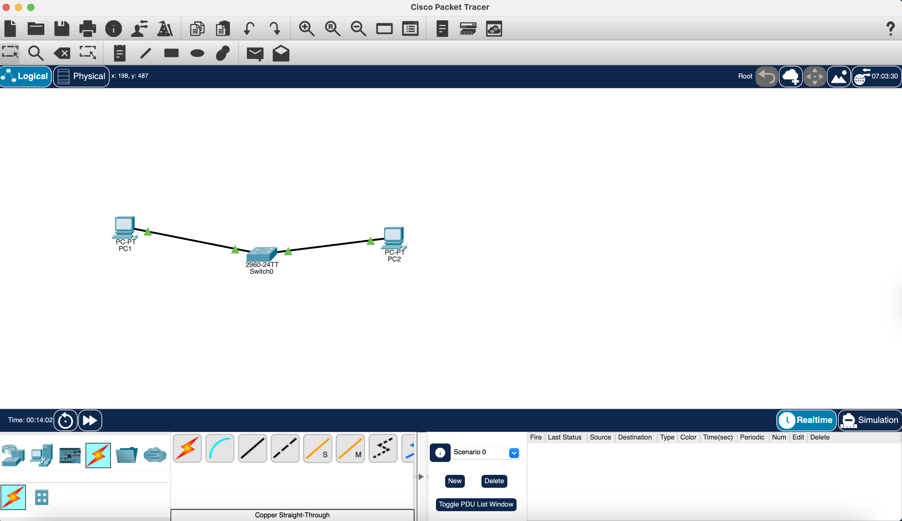
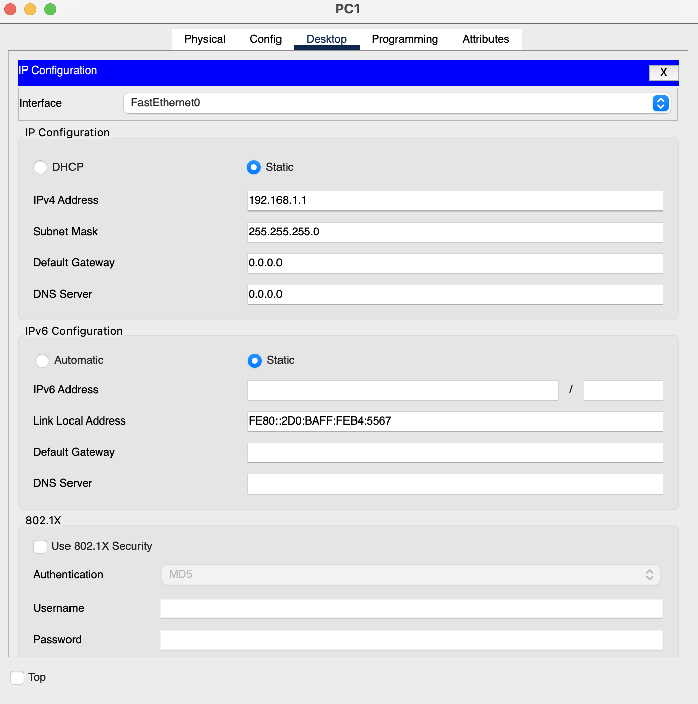
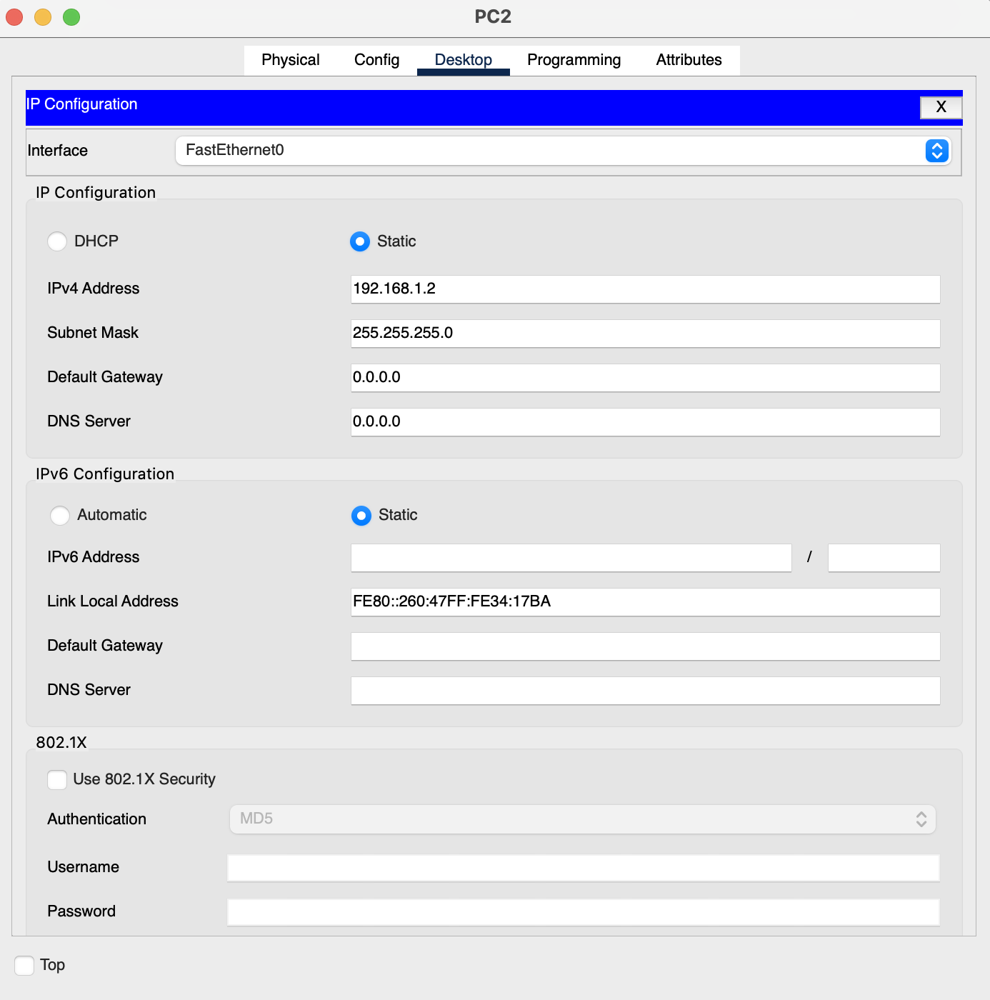
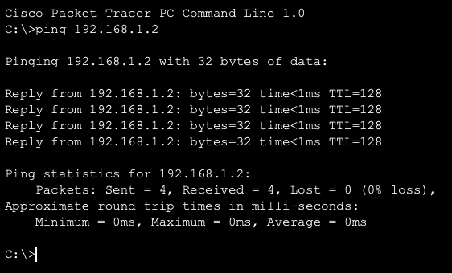

# Network Lab 2 - Packet Tracer Simulation

## Objective
The objective of this lab is to build a simple Local Area Network (LAN) using two computers and a switch, assign IP addresses, and test communication between devices.

---

## Tools Used
- Cisco Packet Tracer

---

## Network Design

In this lab, a simple network was created with:
- 2 PCs (end devices)
- 1 Switch (2960)

Topology:

PC1 —— Switch —— PC2

---

## Configuration

### PC1
- IP Address: 192.168.1.1
- Subnet Mask: 255.255.255.0

### PC2
- IP Address: 192.168.1.2
- Subnet Mask: 255.255.255.0

Both devices are in the same network:
- Network: 192.168.1.0/24

---

## Steps Performed

1. Opened Cisco Packet Tracer and selected the Logical workspace  
2. Added two PCs and one switch to the workspace  
3. Connected both PCs to the switch using copper straight-through cables  
4. Assigned IP addresses manually to both PCs  
5. Opened Command Prompt on PC1  
6. Tested connectivity using the ping command  

---

## Network Components Explanation

### 1. PC (End Devices)
PCs are end-user devices that send and receive data in a network.  
Each device must have a unique IP address to communicate.

---

### 2. Switch (Why we used it)
A switch is used to connect multiple devices within the same network.

- It works at Layer 2 (Data Link Layer)
- It uses MAC addresses to forward data
- It allows communication between devices in a LAN

In this lab, the switch allows PC1 and PC2 to communicate with each other.

---

### 3. Copper Straight-Through Cable (Why we used it)
This cable is used to connect **different types of devices**:

- PC → Switch

It is the correct cable type because:
- PCs and switches are different devices
- It ensures proper transmission of data

---

### 4. IP Addressing
Each device was assigned an IP address:

- PC1: 192.168.1.1  
- PC2: 192.168.1.2  

Both belong to the same network:
192.168.1.0/24

This allows them to communicate directly.

---

### 5. Subnet Mask
The subnet mask (255.255.255.0) defines the network portion of the IP.

 It ensures both devices are in the same network.

---

### 6. Ping Command (Why we used it)
Ping is used to test connectivity between devices.

- It sends ICMP echo requests
- If a reply is received → communication is successful

---

## Results & Analysis

The ping test from PC1 to PC2 was successful.

- Packets Sent: 4  
- Packets Received: 4  
- Packet Loss: 0%  

This confirms:
- Both devices are correctly configured  
- They are in the same network  
- The switch is forwarding data correctly  

The response time was less than 1ms, which shows fast communication within the local network.

---

## Key Learnings

- Learned how to build a basic network topology  
- Understood the role of a switch in a LAN  
- Learned why straight-through cables are used  
- Practiced IP configuration  
- Verified connectivity using ping  
- Gained hands-on networking experience  

---
