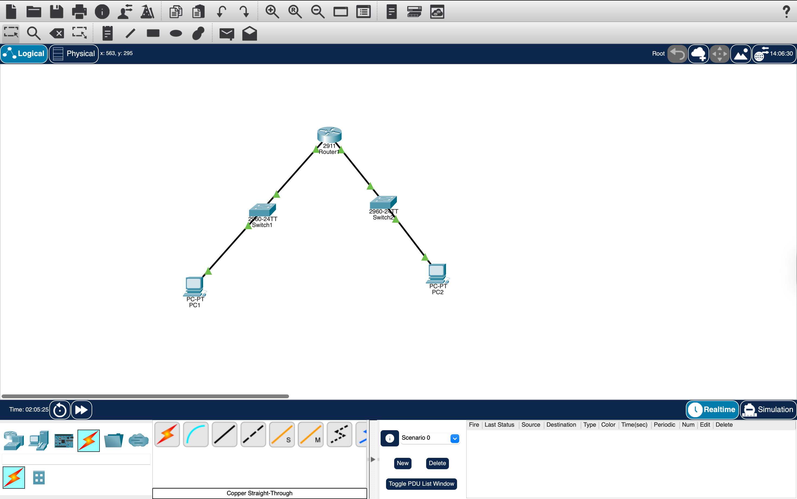
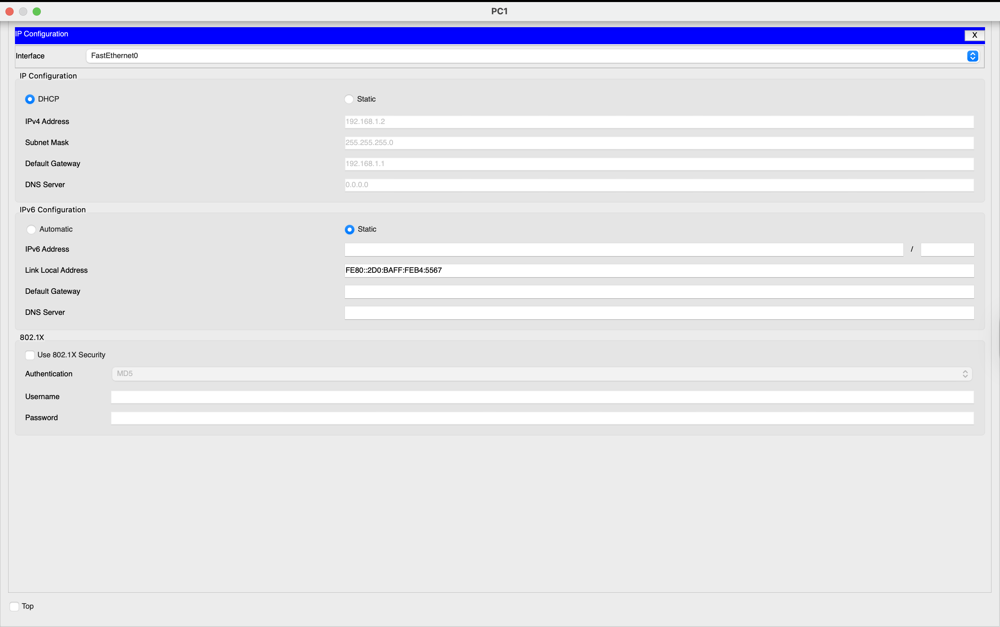
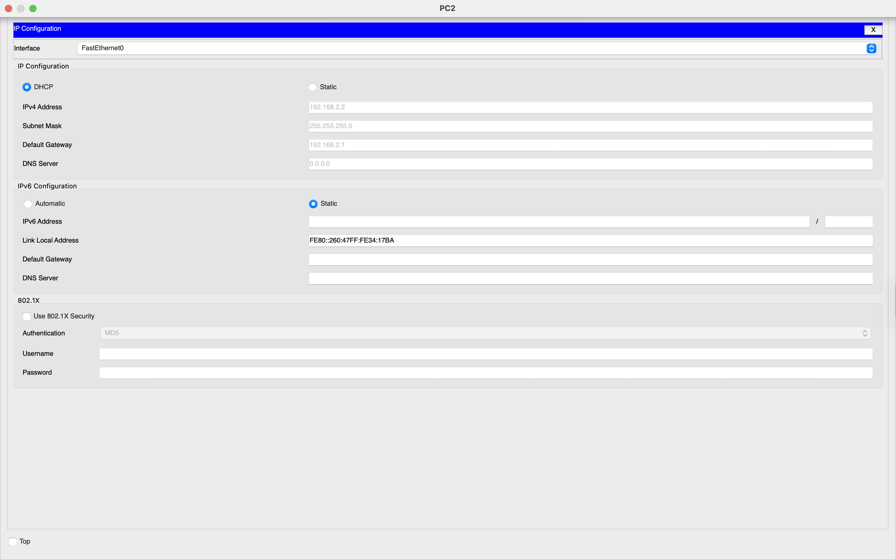
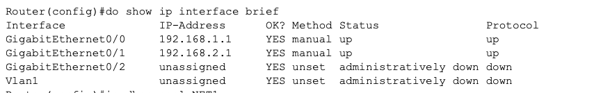
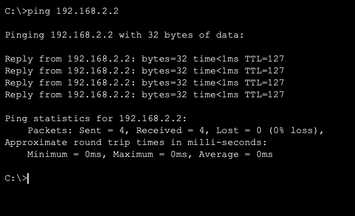
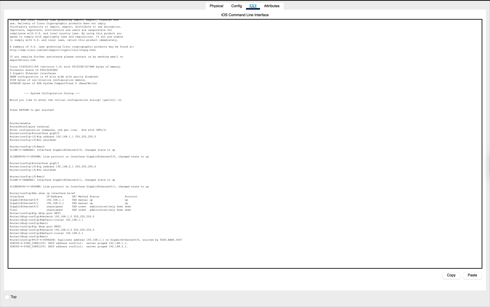

# Network Lab 4 - DHCP and Router Configuration

## Objective
The objective of this lab was to build a small network with two different subnets, configure a router to connect both networks, enable DHCP for automatic IP address assignment, and verify communication between the two PCs.

---

## Tools Used
- Cisco Packet Tracer

---

## Network Topology

PC1 → Switch1 → Router → Switch2 → PC2

This topology was created to simulate communication between two different networks.

---

## Devices Used and Why They Were Used

### 1. PCs
Two PCs were used as end devices.

- PC1 represents a host in Network 1  
- PC2 represents a host in Network 2  

These devices were used to test whether communication could happen across two different networks.

---

### 2. Switches
Two switches were used to connect devices inside each local network.

- Switch1 connects PC1 to the router  
- Switch2 connects PC2 to the router  

A switch is used because it allows multiple devices in the same LAN to communicate. It works at Layer 2 of the OSI model and forwards data using MAC addresses.

---

### 3. Router
The router was the most important device in this lab.

It was used because:
- A router connects different networks  
- It forwards packets between subnets  
- It can also provide DHCP services  

In this lab:
- GigabitEthernet0/0 was used for Network 1  
- GigabitEthernet0/1 was used for Network 2  

Without the router, the two PCs would not be able to communicate because they belong to different networks.

---

### 4. Copper Straight-Through Cable
Copper straight-through cables were used for all connections.

They were used because:
- PC → Switch = different device types  
- Switch → Router = different device types  

Straight-through cable is the correct cable type when connecting different types of networking devices.

---

## IP Addressing Plan

### Network 1
- Network Address: 192.168.1.0/24  
- Router Interface: 192.168.1.1  
- PC1 Address (via DHCP): 192.168.1.2 
 

### Network 2
- Network Address: 192.168.2.0/24  
- Router Interface: 192.168.2.1  
- PC2 Address (via DHCP): 192.168.2.2  

DHCP assigns IP address automatically to the Pc when enabled

---

## Why Two Different Networks Were Used

Two different networks were created to demonstrate routing.

- PC1 was placed in 192.168.1.0/24  
- PC2 was placed in 192.168.2.0/24  

If both PCs were placed in the same network, a router would not be necessary.  
By placing them in different networks, the lab demonstrates how a router forwards traffic between subnets.

---

## Router Configuration (Commands + Explanation)

### Step 1: Enter Configuration Mode

Commands used:  
enable  
configure terminal  

Explanation:  
The `enable` command provides administrative access to the router.  
The `configure terminal` command allows entering configuration mode to modify router settings.

---

### Step 2: Configure Interface for Network 1

Commands used:  
interface gig0/0  
ip address 192.168.1.1 255.255.255.0  
no shutdown  
exit  

Explanation:  
This block configures the first router interface.  
The IP address acts as the default gateway for Network 1.  
The `no shutdown` command activates the interface.

---

### Step 3: Configure Interface for Network 2

Commands used:  
interface gig0/1  
ip address 192.168.2.1 255.255.255.0  
no shutdown  
exit  

Explanation:  
This block configures the second router interface.  
This allows the router to connect a second network and route traffic between both networks.

---

### Step 4: Configure DHCP for Network 1

Commands used:  
ip dhcp pool NET1  
network 192.168.1.0 255.255.255.0  
default-router 192.168.1.1  
exit  

Explanation:  
Creates a DHCP pool for Network 1.  
Automatically assigns IP addresses and gateway information to devices.

---

### Step 5: Configure DHCP for Network 2

Commands used:  
ip dhcp pool NET2  
network 192.168.2.0 255.255.255.0  
default-router 192.168.2.1  
exit  

Explanation:  
Creates a second DHCP pool for Network 2.  
Ensures devices in this network receive IP configuration automatically.

---

### Step 6: Verify Router Configuration

Command used:  
show ip interface brief  

Explanation:  
Used to check whether both interfaces are correctly configured and active (should show "up/up").

Router interface

---

## PC Configuration

Action performed:  
Desktop → IP Configuration → Select DHCP  

Explanation:  
Both PCs were configured to automatically receive IP address, subnet mask, and default gateway from the router.

---

## Connectivity Test

Command used:  
ping 192.168.2.2  

Explanation:  
This command tests communication between PC1 and PC2.  
A successful ping confirms that routing between networks is working properly.

---
## Find all commands here

## Result

- PC1 received IP from Network 1  
- PC2 received IP from Network 2  
- Router successfully connected both networks  
- Communication between PCs was successful  

---

## Key Learnings

- Router connects multiple networks  
- Each interface must belong to a different subnet  
- DHCP automates IP assignment  
- Default gateway enables communication between networks  
- Ping verifies connectivity  

---

## Conclusion

This lab demonstrated how to configure a router to connect two different networks and enable communication between them using DHCP. It provided practical understanding of routing, IP addressing, and network design.

---