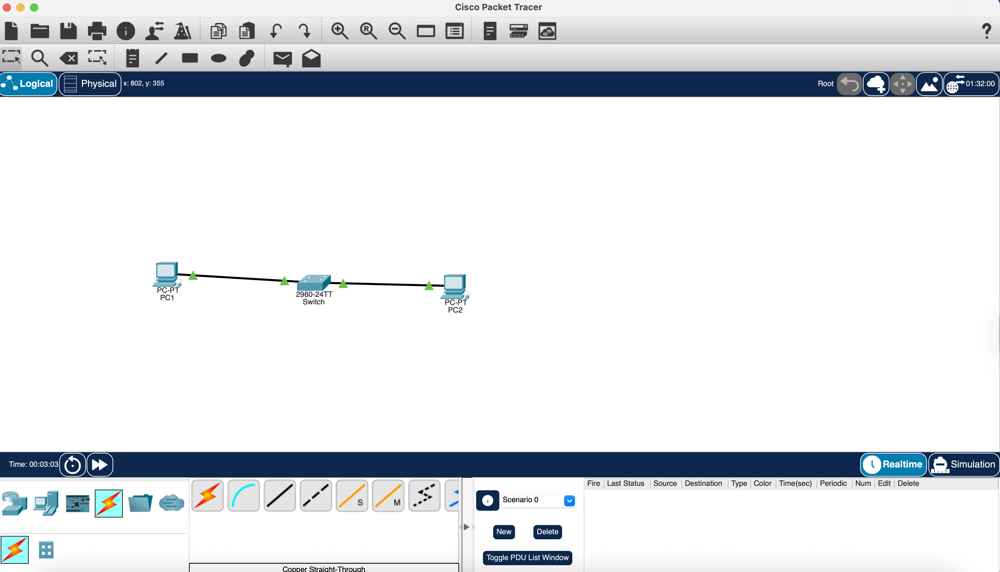
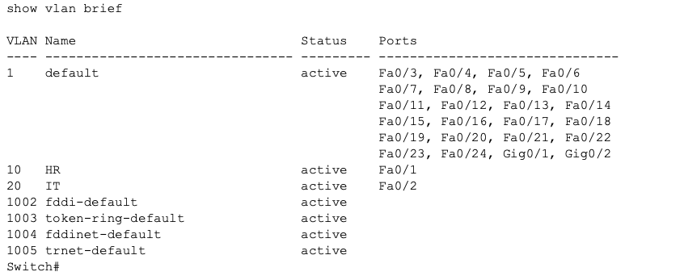
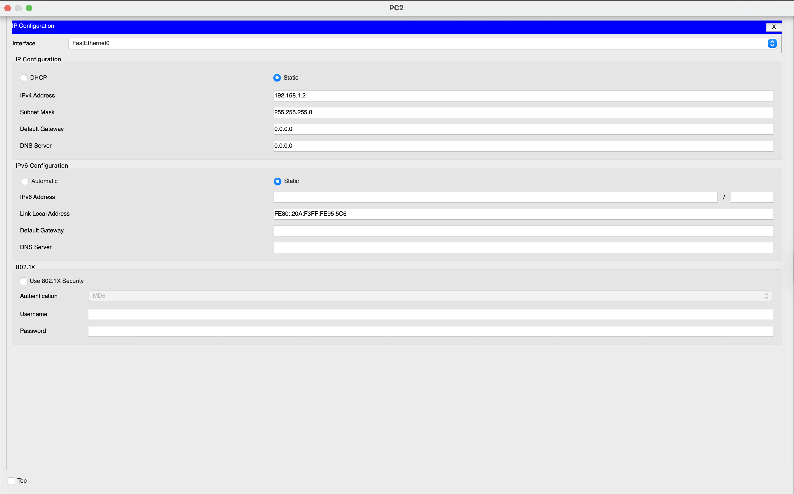
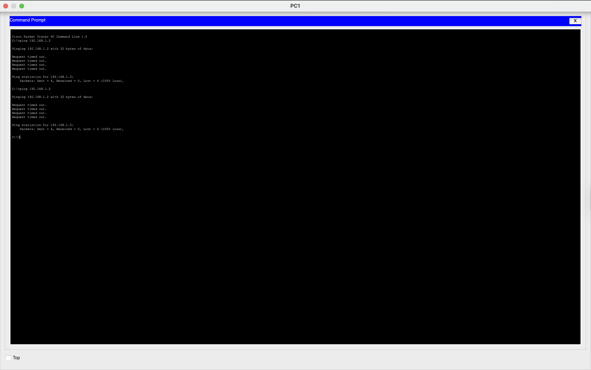
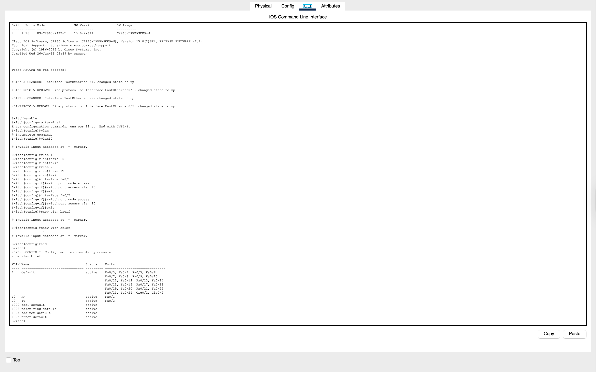

# Network Lab 5 - VLAN Configuration and Segmentation

## Objective
The objective of this lab was to configure VLANs on a switch, assign ports to different VLANs, and demonstrate how VLANs isolate network communication between devices even when they are connected to the same switch.

---

## Tools Used
- Cisco Packet Tracer

---

## Network Topology

PC1 → Switch → PC2

Both PCs are connected to the same switch but placed in different VLANs.

---

## Devices Used and Why They Were Used

### 1. PCs
Two PCs were used as end devices.

- PC1 represents a device in VLAN 10  
- PC2 represents a device in VLAN 20  

These were used to test communication within and across VLANs.

---

### 2. Switch
A single switch was used to create VLANs.

- Switch divides the network logically into multiple VLANs  
- It forwards traffic only within the same VLAN  

---

### 3. Cable Used
- Copper Straight-Through  

Used to connect:
- PC → Switch  

---

## IP Addressing Plan

Both PCs are in the same IP range but different VLANs.

- PC1 → 192.168.1.1  
- PC2 → 192.168.1.2  
- Subnet Mask → 255.255.255.0  

---

## Router Configuration (Not Used in This Lab)

This lab does not use a router because the goal is to demonstrate VLAN isolation.

---

## Switch Configuration (Commands + Explanation)

### Step 1: Enter Configuration Mode

Commands used:  
enable  
configure terminal  

Explanation:  
The `enable` command gives administrative access to the switch.  
The `configure terminal` command allows configuration of VLANs and interfaces.

---

### Step 2: Create VLANs

Commands used:  
vlan 10  
name HR  
exit  

vlan 20  
name IT  
exit  

Explanation:  
Two VLANs were created:
- VLAN 10 for HR  
- VLAN 20 for IT  

This logically separates the network into two groups.

---

### Step 3: Assign Port to VLAN 10

Commands used:  
interface fa0/1  
switchport mode access  
switchport access vlan 10  
exit  

Explanation:  
Port Fa0/1 is assigned to VLAN 10.  
Any device connected to this port becomes part of VLAN 10.

---

### Step 4: Assign Port to VLAN 20

Commands used:  
interface fa0/2  
switchport mode access  
switchport access vlan 20  
exit  

Explanation:  
Port Fa0/2 is assigned to VLAN 20.  
Devices connected here belong to VLAN 20.

---

### Step 5: Verify VLAN Configuration

Command used:  
show vlan brief  

Explanation:  
This command displays:
- VLAN IDs  
- VLAN names  
- Ports assigned to each VLAN  

It confirms correct VLAN configuration.

---

## PC Configuration

Both PCs were configured manually.

### PC1
- IP: 192.168.1.1  
- Subnet Mask: 255.255.255.0  

### PC2
- IP: 192.168.1.2  
- Subnet Mask: 255.255.255.0  

---

## Connectivity Test

Command used:  
ping 192.168.1.2  

Explanation:  
PC1 attempts to communicate with PC2.

---

## Result

- Ping failed (Request timed out)  
- No communication between PCs  

---

## Why Communication Failed

Although both PCs are in the same IP range, they are placed in different VLANs:

- PC1 → VLAN 10  
- PC2 → VLAN 20  

VLANs create separate broadcast domains, meaning devices in different VLANs cannot communicate without a router.

---

## Key Learnings

- VLAN allows logical segmentation of a network  
- Devices in different VLANs cannot communicate directly  
- VLAN improves security and network organization  
- Port-based VLAN assignment controls network access  
- Switch forwards traffic only within the same VLAN  

---

## Conclusion

This lab demonstrated how VLANs can be used to separate devices into different logical networks using a single switch. Even though the devices were connected physically to the same switch, they were unable to communicate due to VLAN segmentation. This concept is widely used in enterprise networks for security and management.

---
### Full Switch CLI Configuration
In the image, the CLI commands used can be found
