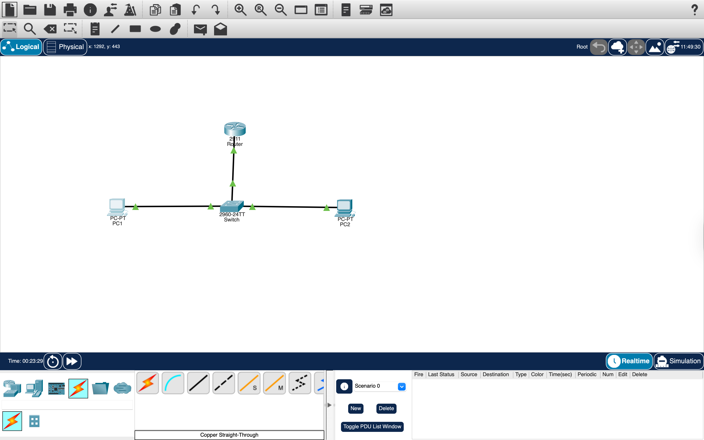
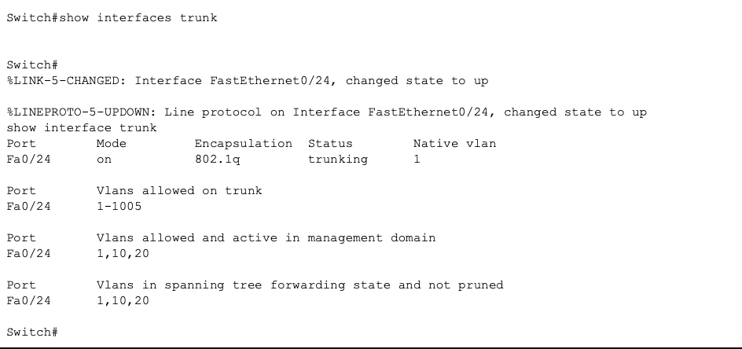
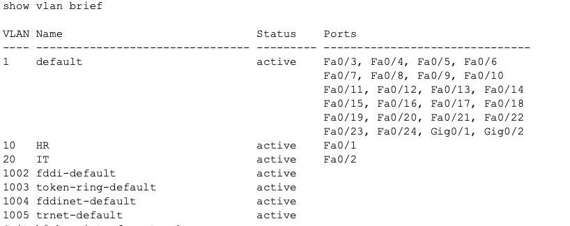
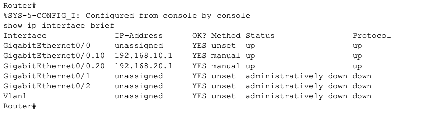
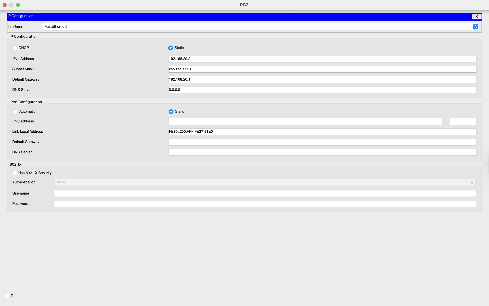
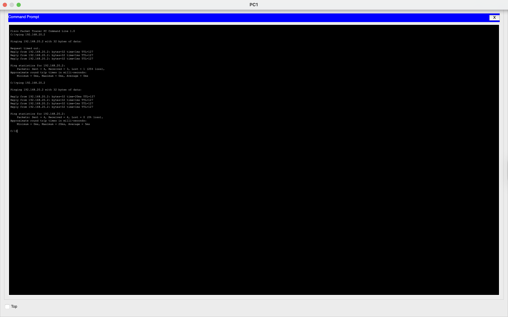
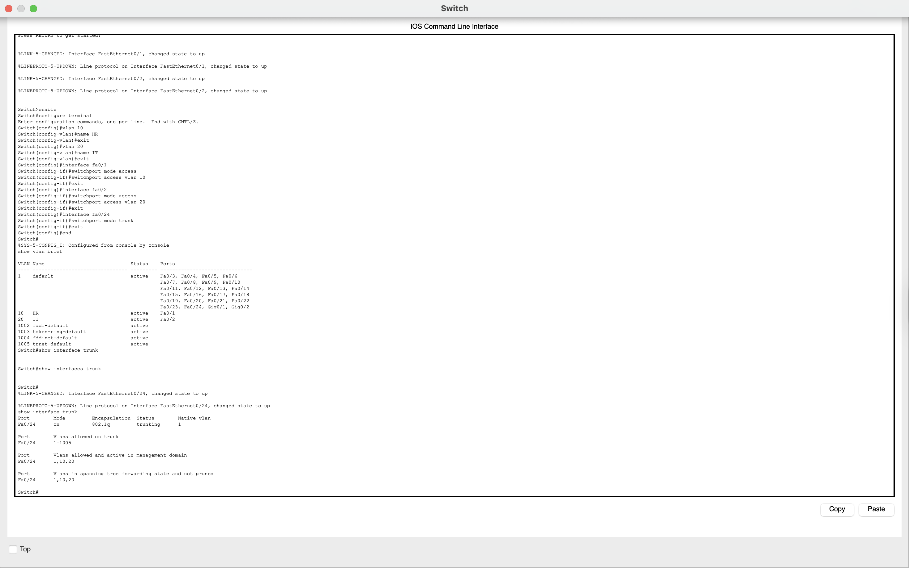
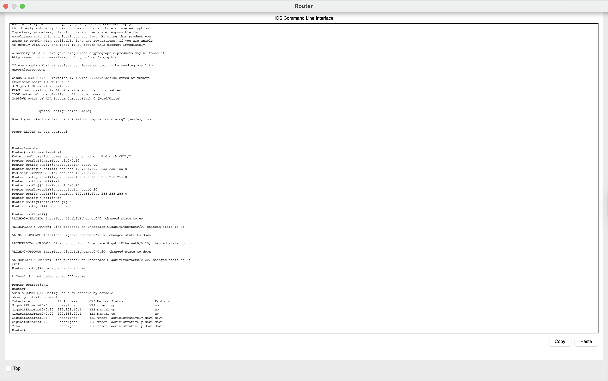

# Network Lab 6 - Inter-VLAN Routing (Router-on-a-Stick)

## Objective
The objective of this lab was to enable communication between devices in different VLANs using a router. This was achieved using the Router-on-a-Stick method, where a single physical interface on the router is divided into multiple subinterfaces to route traffic between VLANs.

---

## Tools Used
- Cisco Packet Tracer

---

## Network Topology

PC1 → Switch → Router → Switch → PC2

---

## Devices Used and Why They Were Used

### 1. PCs
Two PCs were used as end devices.

- PC1 belongs to VLAN 10  
- PC2 belongs to VLAN 20  

They were used to test communication across VLANs.

---

### 2. Switch
The switch was used to:
- Create VLANs  
- Assign ports to VLANs  
- Forward traffic within VLANs  
- Send VLAN traffic to router using trunk  

---

### 3. Router
The router was used to:
- Route traffic between VLANs  
- Act as default gateway for each VLAN  
- Use subinterfaces to handle multiple VLANs  

---

### 4. Cable Used
- Copper Straight-Through  

---

## IP Addressing Plan

### VLAN 10
- Network: 192.168.10.0/24  
- Gateway: 192.168.10.1  
- PC1: 192.168.10.2  

### VLAN 20
- Network: 192.168.20.0/24  
- Gateway: 192.168.20.1  
- PC2: 192.168.20.2  

---

## Switch Configuration (Commands + Explanation)

### Step 1: Enter Configuration Mode

Commands used:  
enable  
configure terminal  

---

### Step 2: Create VLANs

Commands used:  
vlan 10  
name HR  
exit  

vlan 20  
name IT  
exit  

---

### Step 3: Assign Ports to VLANs

Commands used:  
interface fa0/1  
switchport mode access  
switchport access vlan 10  
exit  

interface fa0/2  
switchport mode access  
switchport access vlan 20  
exit  

---

### Step 4: Configure Trunk Port

Commands used:  
interface fa0/24  
switchport mode trunk  
exit  

Explanation:  
This allows VLAN traffic to travel from the switch to the router.

---

### Step 5: Verify VLAN Configuration

Command used:  
show vlan brief  

---

## Router Configuration (Commands + Explanation)

### Step 6: Enter Configuration Mode

Commands used:  
enable  
configure terminal  

---

### Step 7: Configure Subinterfaces

Commands used:  
interface gig0/0.10  
encapsulation dot1Q 10  
ip address 192.168.10.1 255.255.255.0  
exit  

interface gig0/0.20  
encapsulation dot1Q 20  
ip address 192.168.20.1 255.255.255.0  
exit  

Explanation:  
Subinterfaces were created for each VLAN. Each acts as a gateway.

---

### Step 8: Enable Main Interface

Commands used:  
interface gig0/0  
no shutdown  
exit  

---

## PC Configuration

### PC1
- IP: 192.168.10.2  
- Gateway: 192.168.10.1  

---

### PC2
- IP: 192.168.20.2  
- Gateway: 192.168.20.1  

---

## Connectivity Test

Command used:  
ping 192.168.20.2  

Explanation:  
This confirms communication between VLANs.

---

## Result

- Ping successful  
- VLAN communication established  

---

## Key Learnings

- VLANs isolate networks  
- Trunk allows multiple VLANs  
- Router enables communication  
- Subinterfaces act as gateways  

---

## Full CLI Configurations (Optional)

### Switch CLI
The complete switch configuration can be viewed below:

---

### Router CLI
The complete router configuration can be viewed below:

