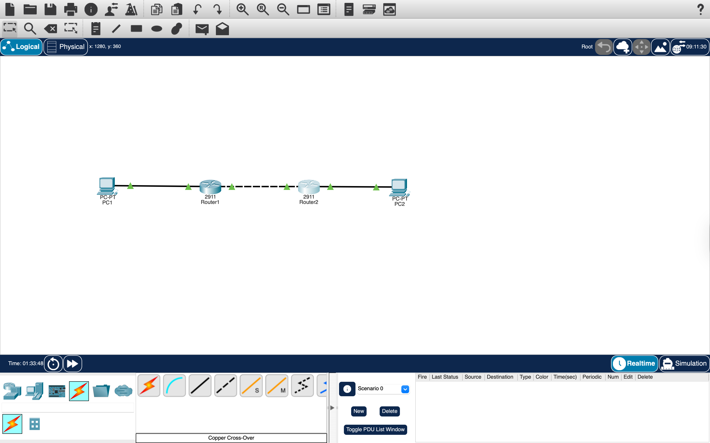
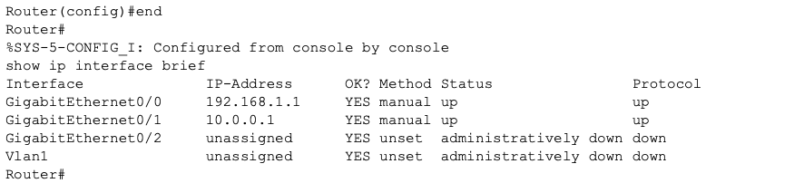
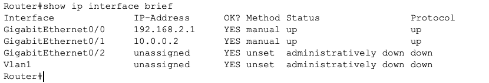
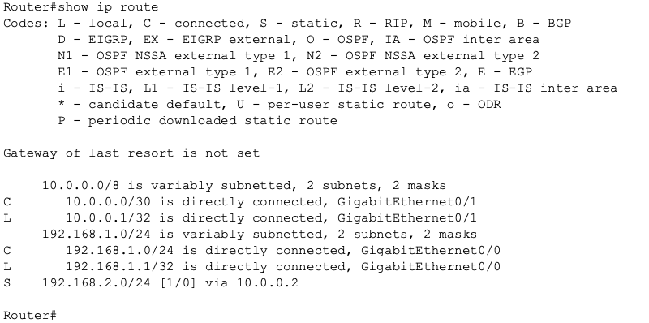
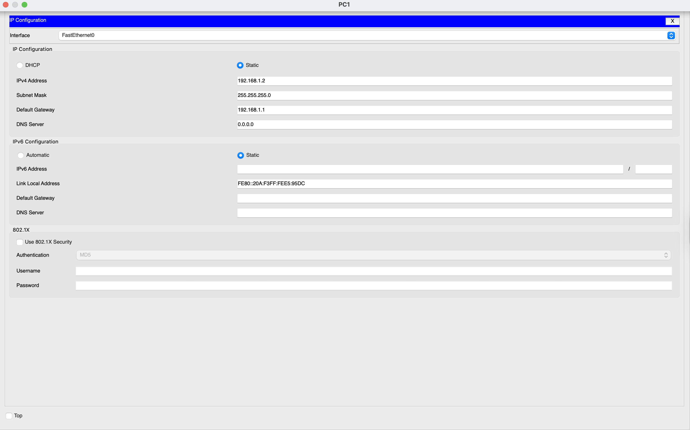
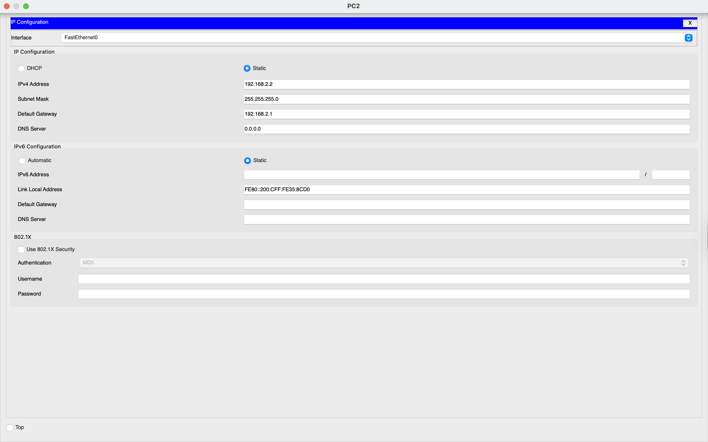
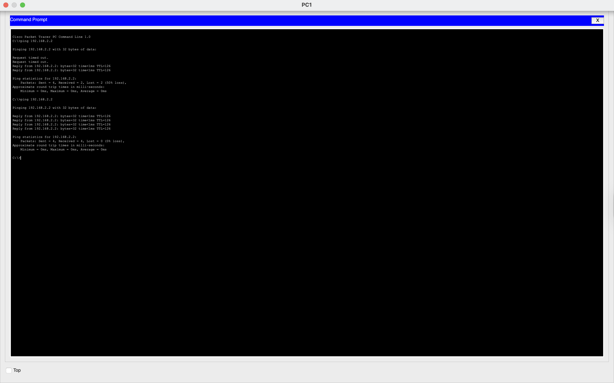
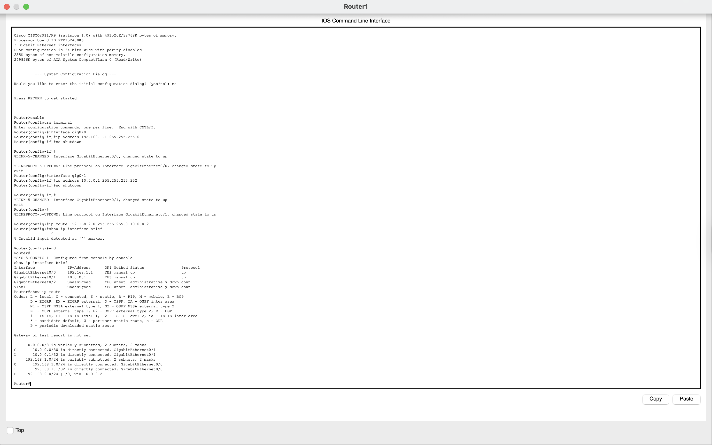
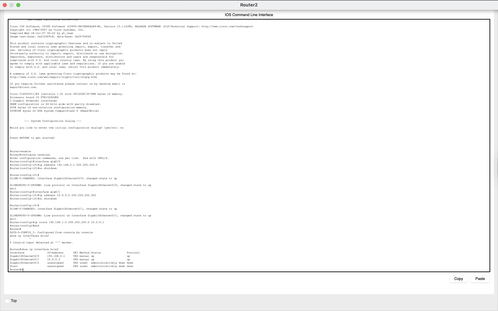

# Network Lab 7 - Static Routing (Basic Network Design)

## Objective
The objective of this lab was to connect two different networks using two routers and enable communication between them using static routing. This lab demonstrates how routers forward traffic between separate networks using manually configured routes.

---

## Tools Used
- Cisco Packet Tracer

---

## Network Topology

PC1 → Router1 → Router2 → PC2

---

## Devices Used and Why They Were Used

### 1. PCs
Two PCs were used as end devices.

- PC1 belongs to Network 1  
- PC2 belongs to Network 2  

They were used to test communication across different networks.

---

### 2. Routers
Two routers were used to connect different networks.

- Router1 connects Network 1  
- Router2 connects Network 2  
- Both routers communicate with each other using a separate network  

Routers forward packets between networks.

---

### 3. Cable Used
- Copper Straight-Through (PC to Router)  
- Copper Cross-Over (Router to Router)  

---

## IP Addressing Plan

### Network 1
- Network: 192.168.1.0/24  
- Router1 (Gateway): 192.168.1.1  
- PC1: 192.168.1.2  

### Network 2
- Network: 192.168.2.0/24  
- Router2 (Gateway): 192.168.2.1  
- PC2: 192.168.2.2  

### Router-to-Router Network
- Network: 10.0.0.0/30  
- Router1: 10.0.0.1  
- Router2: 10.0.0.2  

---

## Router Configuration (Commands + Explanation)

### Step 1: Configure Router 1 Interfaces

Commands used:  
enable  
configure terminal  

interface gig0/0  
ip address 192.168.1.1 255.255.255.0  
no shutdown  
exit  

interface gig0/1  
ip address 10.0.0.1 255.255.255.252  
no shutdown  
exit  

Explanation:  
Router1 was configured with two interfaces:
- One for Network 1  
- One for communication with Router2  

---

### Step 2: Configure Router 2 Interfaces

Commands used:  
enable  
configure terminal  

interface gig0/0  
ip address 192.168.2.1 255.255.255.0  
no shutdown  
exit  

interface gig0/1  
ip address 10.0.0.2 255.255.255.252  
no shutdown  
exit  

Explanation:  
Router2 was configured similarly:
- One interface for Network 2  
- One for communication with Router1  

---

### Step 3: Configure Static Routes

Commands used:

On Router1:  
ip route 192.168.2.0 255.255.255.0 10.0.0.2  

On Router2:  
ip route 192.168.1.0 255.255.255.0 10.0.0.1  

Explanation:  
Static routes were added to tell each router how to reach the other network.

- Router1 sends traffic for Network 2 via Router2  
- Router2 sends traffic for Network 1 via Router1  

---

## PC Configuration

### PC1
- IP: 192.168.1.2  
- Subnet Mask: 255.255.255.0  
- Default Gateway: 192.168.1.1  

---

### PC2
- IP: 192.168.2.2  
- Subnet Mask: 255.255.255.0  
- Default Gateway: 192.168.2.1  

---

## Connectivity Test

Command used:  
ping 192.168.2.2  

Explanation:  
PC1 sends packets to PC2 through both routers.

---

## Result

- Communication between two networks was successful  
- Static routing enabled packet forwarding  
- Routers correctly directed traffic  

---

## Why Static Routing is Used

- Defines fixed paths between networks  
- Useful in small networks  
- Simple and easy to configure  
- No automatic route learning required  

---

## Key Learnings

- Routers connect multiple networks  
- Static routes define traffic paths  
- Each router must know all networks  
- Proper IP addressing is critical  
- Routing tables determine packet forwarding  

---

## Conclusion

This lab demonstrated how static routing enables communication between separate networks using multiple routers. It provided a clear understanding of how routers use routing tables to forward packets and establish connectivity across networks.

---

## Full CLI Configurations (Optional)

### Router 1 CLI
The complete configuration can be viewed below:

---

### Router 2 CLI
The complete configuration can be viewed below:

