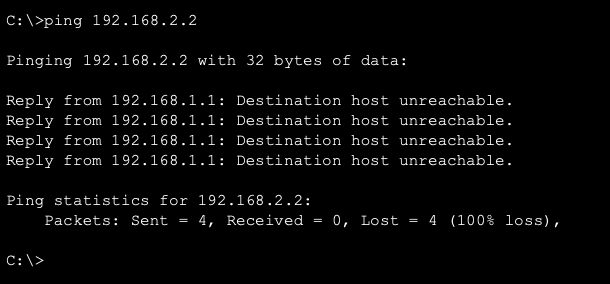
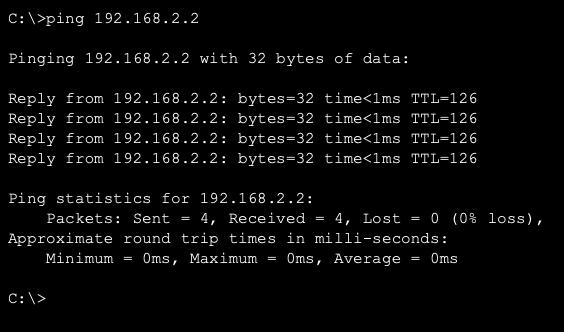

# Network Lab 8 - Network Troubleshooting and Connectivity Analysis

## Objective
The objective of this lab was to simulate common network issues, identify the root cause of connectivity failures, and apply appropriate fixes. This lab focuses on troubleshooting techniques used in real-world networking environments.

---

## Tools Used
- Cisco Packet Tracer

---

## Network Topology

This lab reuses the same network setup from Lab 7 (Static Routing).

PC1 → Router1 → Router2 → PC2

---

## Base Configuration

The entire network was first configured exactly as in Lab 7, including:

- IP addressing  
- Router interface configuration  
- Static routing between networks  

This ensured that the network was fully functional before introducing faults.

---

## Working Network Verification

Before troubleshooting, connectivity was verified.

Command used:  
ping 192.168.2.2  

---

## Troubleshooting Scenarios

Multiple faults were intentionally introduced into the network to simulate real-world issues.

---

### Scenario 1: Incorrect Default Gateway

Issue:
The default gateway on PC1 was changed to an incorrect value.

Change made:
- 192.168.1.1 → 192.168.1.99  

Result:
- Ping failed  

Cause:
The PC could not forward traffic outside its network due to an invalid gateway.

Fix:
- Restored correct gateway (192.168.1.1)

---

### Scenario 2: Router Interface Shutdown

Issue:
Router1 interface connecting to Router2 was disabled.

Command used:  
interface g0/1  
shutdown  

Result:
- Communication between routers stopped  
- Ping failed  

Cause:
The link between routers was down.

Fix:  
interface g0/1  
no shutdown  

---

### Scenario 3: Incorrect Static Route

Issue:
A wrong next-hop IP address was configured.

Command used:  
ip route 192.168.2.0 255.255.255.0 10.0.0.99  

Result:
- Packets were sent to an invalid path  
- Ping failed  

Cause:
Router could not reach the destination network.

Fix:  
no ip route 192.168.2.0 255.255.255.0 10.0.0.99  
ip route 192.168.2.0 255.255.255.0 10.0.0.2  

---

### Scenario 4: Incorrect IP Address

Issue:
PC2 IP address was changed to an incorrect network.

Change made:
- 192.168.2.2 → 192.168.3.2  

Result:
- Devices were in different networks  
- Ping failed  

Cause:
Incorrect IP addressing prevented communication.

Fix:
- Restored correct IP (192.168.2.2)

---

## Connectivity Restoration

After resolving all issues, connectivity was restored.

Command used:  
ping 192.168.2.2  

---

## Troubleshooting Commands Used

### On PC
- ping  

### On Router
- show ip interface brief  
- show ip route  

---

## Troubleshooting Methodology

A structured approach was followed:

1. Verify IP configuration  
2. Check default gateway  
3. Verify interface status  
4. Check routing table  
5. Test connectivity  

---

## Key Learnings

- Network issues are often caused by simple misconfigurations  
- Default gateway is critical for communication outside the network  
- Interface status directly affects connectivity  
- Static routes must be configured accurately  
- Troubleshooting requires a systematic approach  

---

## Conclusion

This lab demonstrated how to diagnose and resolve common network issues by applying logical troubleshooting steps. It reinforced the importance of understanding network fundamentals and following a structured process to identify and fix problems.